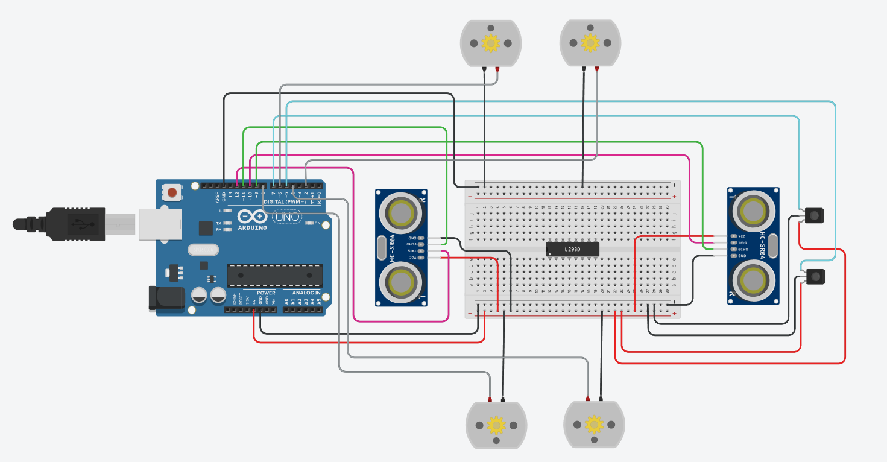

# Proyecto-Hack4Change

Código del movimiento de una carretilla con seguimiento de línea y sensores de detección de obstaculos.

## Componentes
La estrucutra del coche gira en torno a un Arduino central, que controla:
- 4 Motores de Rotación Continua.
- Driver L298N (todavía no está confirmado).
- 2 Sensores de Ultrasonido.
- 2 Sensores IR.

## Configuración

Nota: los motores deben de conectarse al Driver, depende de que Driver tengamos disponibles su configuración varía.

## Variables Importantes
A parte de las variables que declaran los pines de los diferentes componentes tenemos otras dos a destacar:

`String destino`: Está pensada para que funcione a modo de lista (todavía no implementada). La idea de esta variable es que almacene una cadena de caracteres con forma "NNNN...N". Las `N` son los número de salida de las rotondas.

`int salida`: Es cada una de las salidas que se representan en destino (no está declarada al principio).

Ejemplo práctico:

```c++
String destino = "123123";
```

Esta cadena indica que tiene que tomar `6` rotondas. En la primera rotonda, tomará la salida 1; en la segunda rotonda, la salida dos; en la tercera rotonda, la salida tres; y así sucesivamente.

## Funciones

### setup()
En el setup se inicializan todas las variables para preparar a cada componente con su correcto funcionamiento. También se inicializa el Monitor en Serie en 9600.
### loop()
Esta función es el corazón de la carretilla. Para empezar comprobamos si hay un obstáculo, la única forma de que se detenga es que la distancia de cualquiera de los dos sensores ultrasónicos sea inferior a 10 (variable completamente conceptual).

En caso de que la distancia sea mayor y no haya peligro, el vehículo entrará en estado de movimiento, que dependerá completamente de los sensores IR. Estos dos sensores son, por decirlo de alguna manera, los pilotos.
```c++
void loop() {
  // Condiciones:
  // Si la distancia recibida por los ultrasónicos es menor a 10, el coche se detiene, luego:
  if (distancia(trigger1, echo1) < 10 || distancia(trigger2, echo2)) {
    detener();
  } else {
    // Si la distancia supera los 10 cm, entonces el coche se moverá:
    if (sensoresIR(ir1) !=1 && sensoresIR(ir2) !=1) {
      // Si solo se activa un sensor o ninguno, el movimiento del coche será "normal";
      movimiento(ir1, ir2);
    } else {
      int salida = cadena.substring(0, 1).toInt();
      dobleLinea(salida);
      cadena = cadena.substring(1);
    }
  }
}
```
Si se activan los dos sensores IR, activamos la dobleLinea, que es una función que se encarga de controlar las rotondas, en base al primer caracter de la lista de salidas de rotonda `destino`.

En este trozo de código, damos valor a salida como el valor entero del primer caracter del String, el cual se lo pasamos a la función "dobleLinea()". Para finalizar borramos el primer caracter, para que cuando haga el loop pase al valor numérico de la segunda rotonda.
```c++
int salida = cadena.substring(0, 1).toInt();
      dobleLinea(salida);
      cadena = cadena.substring(1);
```

### movimiento()
En la función de movimiento, depende de los valores tomados por los sensores, el vehículo se moverá hacia delante o a los lados. Siempre pensando en no salir de la línea de circulación.
```c++
void movimiento(int sensorIRDerecha, int sensorIRIzquierda) {
  if (sensoresIR(sensorIRDerecha) == 0 && sensoresIR(sensorIRIzquierda == 0)) {
    adelante();
  } else if (sensoresIR(sensorIRDerecha) == 1 && sensoresIR(sensorIRIzquierda) == 0) {
    derecha();
  } else if (sensoresIR(sensorIRDerecha) == 0 && sensoresIR(sensorIRIzquierda) == 1) {
    izquierda();
  }
}
```

### Código para los Sensores
`distacia` calcula la distancia según el trigger y el echo de cada sensor IR, debido a que se usa muchísimo en el código, he creado una función a parte.
`sensoresIR` convierte el estado del sensor IR en 0 o 1. Si el sensor está activo, devuelve un uno, si no, devuelve un 0.
```c++
int distancia(int Trigger, int Echo) {
  long t; // Tiempo que tarda en llegar el eco
  long d; // Distancia en centimetros
 
  digitalWrite(Trigger, HIGH);
  delayMicroseconds(10);          
  digitalWrite(Trigger, LOW);
  
  t = pulseIn(Echo, HIGH); 
  d = t/59;

  return d;
}

int sensoresIR(int sensorIR) {
  int estado = digitalRead(sensorIR);
  if (estado == LOW) {
    return 0;
  }
  return 1;
}
```